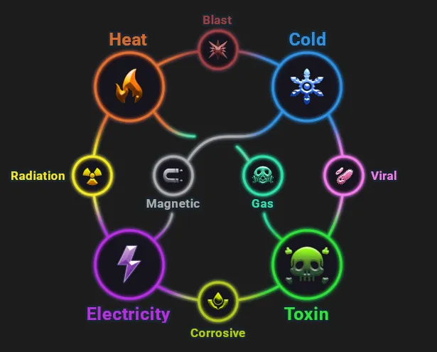
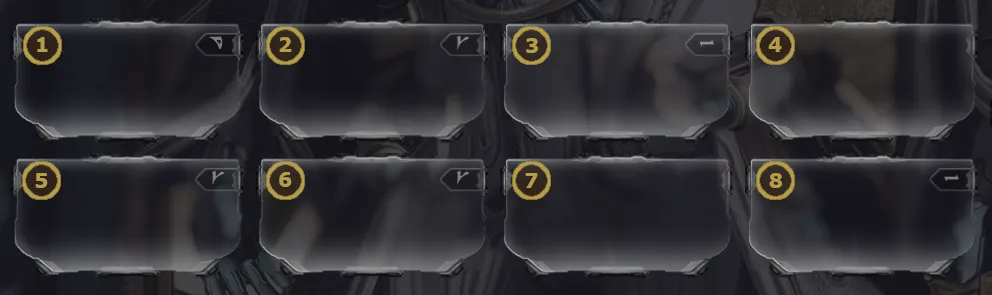
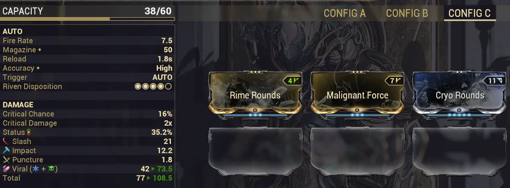
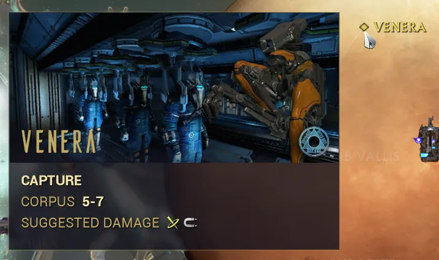

# Damage Types & Status Effects

Table of Contents

- [Overview](#overview)
- [Damage Types](#damage-types)
- [How Elements Combine](#how-elements-combine)
- [Status Effects](#status-effects)
- [Status Effect Tips](#status-effect-tips)
- [Faction Bonuses](#faction-bonuses)

## Overview

In Warframe, there are so many different damage types, each with their own strengths, limitations, and unique status effects. What damage types you pick will directly impact how you mod and how your builds perform, so understanding this system is very important. This page covers the many damage types in Warframe, how elements combine, what status procs do, and finally some tips when modding for specific status effects.

---
## Damage Types

Warframe's damage system is broken down into three categories: physical, elemental, and
special damage types.

**Physical (IPS):**

Physical damage consists of three types: Impact, Puncture, and Slash, collectively referred to as IPS. Unlike elemental damage, IPS damage types cannot be added to a weapon through mods if it wasn't already present on the weapon. As a general rule of thumb, IPS mods are not recommended because they have limited scaling and do not boost status proc damage.

**Primary Elemental:**

The four primary elements are Heat, Cold, Toxin, and Electricity. These can be added to any weapon through mods and are the building blocks for secondary elemental damage types.

**Secondary Elemental:**

Secondary elements are created by combining two primary elements. The six secondary elements are:

| Secondary Element | Combination |
|--------|-------------|
| Blast | Heat + Cold |
| Corrosive | Toxin + Electricity |
| Radiation | Heat + Electricity |
| Viral | Cold + Toxin |
| Gas | Heat + Toxin |
| Magnetic | Cold + Electricity |

<figure class="guide-text-image__img" style="flex: 0 0 35%;">
  
</figure>

**Special**

There are 3 special damage types currently in Warframe: True, Void, and Tau damage. These cannot be added through standard mods and are typically tied to specific weapons, abilities, or mechanics. True damage bypasses all resistances and damage reduction. Void damage is associated with Xaku and Operator abilities, and Tau damage is tied to Caliban and the Sentients.

---
## How Elements Combine

### Mod Order

When using multiple elemental mods, elements combine from left to right and top to bottom (just like you're currently reading this). Two primary elements that are next to each other in this order will combine into their secondary element, so misordering your mods can lead to unintended elemental combinations. 

Additionally, once two elements have been combined they cannot be split again. If you add a third mod for one of the primary elements used to create a secondary element, that mod will simply boost the existing secondary element rather than create a new instance of the primary. 

<figure class="guide-text-image__img" style="flex: 0 0 40%;">
  
</figure>

<figure style="text-align: center; width: 70%; margin: 0 auto; min-width: min(300px, 100%);">
  
  <figcaption>Adding a second Cold mod to an existing Cold + Toxin (Viral) combo will increase Viral damage rather than create a separate Cold damage type.</figcaption>
</figure>

### Innate Elements & Progenitors

Additionally, some weapons have innate elemental damage built in, like the Trumna, or have progenitor bonus elements, like the Kuva, Tenet, and Coda weapons. These innate and progenitor elements behave as imaginary 'last' slots at the end of your mod page, combining with whatever elements precede them. 

---
## Status Effects

Each damage type has an associated status proc that gets applied when a weapon triggers a status. As previously mentioned, these status effects can be a large factor in determining how you want to mod. The following covers what each status proc does.

### Physical (IPS):

**Physical**

| Status | Effect | Max Stacks | Duration | Refreshable |
|--------|--------|------------|----------|-------------|
| Impact | Staggers enemy; lowers mercy kill threshold | 5 | 6s | Yes |
| Puncture | Reduces target's damage by 40-80%; +5-25% flat crit chance vs target | 5 | 10s | Yes |
| Slash | Bleed DoT dealing true damage| None | 6s per stack | No |

### Elemental

**Primary Elements**

| Status | Effect | Max Stacks | Duration | Refreshable |
|--------|--------|------------|----------|-------------|
| Heat | Panics enemy; strips up to 50% armor; burn DoT | None | 6s | Yes |
| Cold | Slows enemy; +0.05x to +0.45x crit damage vs target; freezes at 10 stacks (+1x crit damage) | 10 | 6s (3s Freeze) | No |
| Electricity | Stuns, shock DoT chains to targets within 3m; shocks can headshot | None | 6s per stack | No |
| Toxin | Poison DoT that bypasses shields | None | 6s per stack | No |

**Secondary Elements**

| Status | Elements | Effect | Max Stacks | Duration | Refreshable |
|--------|----------|--------|------------|----------|-------------|
| Blast | Heat + Cold | Delayed detonation; at 10 stacks or kill, larger AOE | 10 | 1.5s per stack | No |
| Corrosive | Toxin + Electricity | Strips 26-80% armor | 10 | 8s per stack | No |
| Radiation | Heat + Electricity | Confuses enemies; targets deal 100-550% damage to non-Tenno | 10 | 12s per stack | No |
| Viral | Cold + Toxin | Amplifies health damage by 100-325% (2x-4.25x) | 10 | 6s per stack | No |
| Gas | Heat + Toxin | Poisonous 3-6m gas cloud DoT around target | 10 | 6s per stack | No |
| Magnetic | Cold + Electricity | Amplifies shield and Overguard damage by 100-325%, forced elec proc on shield/OG break | 10 | 6s per stack | No |

### Special

| Status | Effect | Max Stacks | Duration | Refreshable |
|--------|--------|------------|----------|-------------|
| Void | Bullet attractor bubble on hit body part | 1 | 3s | Yes |
| Tau | Increases status chance against target by 10-100% | 10 | 8s per stack | No |

---
## Status Effect Tips

I've put together a list of a few practical notes on some status effects:

- Blast works best with high status, high fire rate weapons that can apply 10 stacks reliably or is best with one-shot weapons that can apply a stack and trigger the on-kill detonation. Blast is also not good against bosses, who often limit the number of stacks a status can apply. 
- Gas pairs nicely with high damage weapons with average status chance since the cloud caps at 10 stacks. It's great for chokepoints where you can reliably drag multiple people into the clouds.
- Toxin is very effective against the Corpus since all Toxin damage bypasses shields. 
- Enemies on the Cambion Drift are immune to Viral procs and have Viral resistance.
- Elemental DoTs scale with their elemental modifier. Having a 90% Heat mod means your Heat procs will do 90% more
- Secondary elemental DoTs don't scale with their component's elemental modifiers. For example, Blast procs will scale with Blast modifiers but not with Heat or Cold modifiers
- Viral + Heat is a pretty generic elemental combo that will do decently against a lot of factions
- Slash procs do not scale with Slash damage modifiers, which is partially why IPS mods are rarely recommended on builds. 

---
## Faction Bonuses

As a final note, each faction in Warframe has its own damage type vulnerabilities and resistances, applying a 50% damage bonus or reduction to specific damage types. While status effects are very impactful, these modifiers are worth keeping in mind, especially for builds that do not rely as heavily on status application. The table below covers the four major factions you'll encounter most frequently early on.

| Faction | Weaknesses | Resistances |
|---------|------------|-------------|
| Grineer | Impact, Corrosive | None |
| Corpus | Puncture, Magnetic | None |
| Infested | Slash, Heat | None |
| Orokin | Puncture, Viral | Radiation |

You can check a faction's modifiers in game by checking enemies in the Codex or by hovering over a mission node on the Star Chart, which displays recommended damage types.

<figure class="guide-text-image__img" style="flex: 0 0 35%;">
  
</figure>

> **Note:** For a full breakdown of all faction modifiers, check out the wiki's [Damage/Overview Table](https://wiki.warframe.com/w/Damage/Overview_Table).