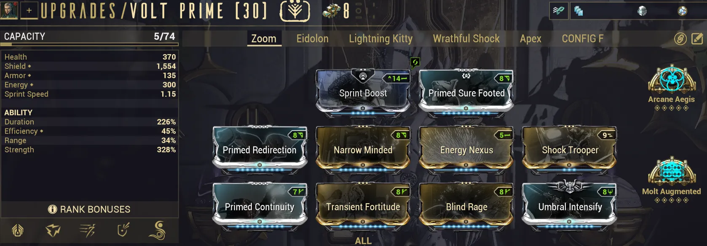
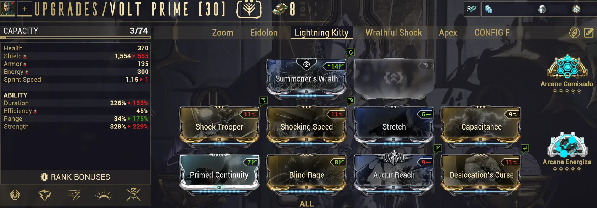

# Modding: A Checklist for Warframes

Table of Contents

- [Overview](#overview)

## Overview

This guide walks through my personal checklist for building Warframes from scratch and is based on lessons and tips I've picked up through my time playing Warframe. The goal of this guide, along with my other checklists, is to give you a repeatable thought process that you can apply to any moddable item in Warframe. Builds created this way may not be 'perfect', but they will be functional and can serve as a great starting point for refining your final builds. Even if you decide to always follow build guides, this thought process will be helpful for evaluating guides and understanding how they function. 

My Warframe checklist has 5 questions, and at the end, I've included regular and Steel Path Frost builds to show the process.

---
## The Checklist

1. What Do All the Abilities Do?
2. What Style of Play Do I Want?
3. How Do I Survive?
4. What Stats Do I Want?
5. What QoL Would Be Good?

---
## 1. What Do All the Abilities Do?

The first step is simply to read over all of your Warframe's abilities. Get a general idea of what each ability does and how they might synergize with each other. For example, abilities that buff melee critical chance, grant invisibility, or allow for flight will drastically change how a Warframe functions and how you might want to play it.

---
## 2. What's My Playstyle?

Most Warframes have multiple build archetypes so the second step is to figure out how you want to play the frame. 

Most builds fall into three general archetypes:

- **Weapon Platforms** - Builds that focus purely on buffing your weapons and letting your guns or melee do the damage (e.g. Roar Rhino builds)
- **Casters** - Builds that focus on abilities or exalted weapons as your primary damage source (e.g. Grasp of Lokh Xaku)
- **Hybrid / Utility** - Builds that provide utility or flexibility where you don't specialize into either of the above (e.g. Despoil Desecrate Nekros)

Foe example, here are my weapon platform and caster summoner Volt builds side by side. Each functions very differently and as such are modded quite differently. 

  <figure>
    
  </figure>
  <figure>
    
  </figure>

---
## 3. How Do I Survive?

> **Note:** This section goes into a lot more detail than the rest of the guide because it covers a lot of info about defensive layers. Don't worry if everything doesn't click immediately. The goal is to just give you an idea of how defenses work in Warframe and how you want to mod for these. 

One of the core concepts of Warframe is that you need to stay alive to do anything. As such, the third step is to figure out how you'd like to do that based on your Warframe's stats, its abilities, and your chosen playstyle. A good rule of thumb is to aim for 2-3 synergistic effects, such as pairing health tanking with armor and damage reduction mods.

Below are some of the defensive 'layers' you can consider for your builds

### Health Tanking

### Shield Tanking

If a frame has bad health/armor, shield tanking or shield gating is your solution. There are multiple forms of shield tanking / gating, which we will cover below.
#### What Makes Shields Different from Health
When your shields break you are given a small period of invincibility 0.33-2.5s based on the highest value your shields recharged to since your last shield break. This is what's referred to as the "shield gate". This allows you to survive hits that would typically one shot you. 

#### Shield Tanking
This is your early game shield defense setup. It'll let you survive some hits and recharge a bit faster when your shields go down. 
- Shield mod
- Shield recharge rate mod

It will NOT be sufficient for higher level content where you want to focus on shield gating. 

#### Shield Gating (Shield on Energy Spent)
At high enemy levels, you want to use shield gating instead. Brief Respite/augur mods are one option (energy spent converted to shields). The idea is that when your shields break, you get your invincibility. Then you cast an ability to restore your shields to a decent amount. You'll generally want at least one easily re-castable ability and lower efficiency which translates to more energy spent and more shields restored. If energy is an issue and mod slots aren't, you can also consider Catalyzing Shields. 

#### Shield Gating (Catalyzing Shields)
Catalyzing shields lowers your total shields but gives you 1.33s invincibility if your shields fully recharge before getting broken again. You can pair this with brief respite or augur mods to early regenerate shields. 

NOTE: Catalyzing Shields has been bugged since release and gives 1.33s invincibility with ANY amount of shields restored, making it much better
#### Shield Gating (Shield Recharge Rate)

Certain mods and Arcane like Arcane Aegis and Fast Deflection can lower your shield recharge delay, aka the time it takes before your shields naturally decay. 
This can be paired with stuff like brief respite and/or catalyzing shields as a second layer of protection or just run alone in lower level play
**NOTE**: Because of how Arcane Aegis works, when it triggers you effectively get 12s of invincibility (except for toxin).
#### Damage Reduction (DR)
Some frames have abilities that grant % damage reduction like Nova's Null Stars (her 1) or Mirage's Eclipse (her 3). Otherwise, Adaptation is the main way to get damage reduction. DR synergizes with health tanking really well and some types of shield tanking. It's generally not as impactful at super high levels where you may get one shot regardless.

### Damage Reduction

### Invisibility

Some frames can turn invisible with abilities while pure ability casters can also utilize Shade's or Huras' invisibility precept. 
Invisibility is a great way to protect yourself. **HOWEVER** do note that gunfire can and will alert enemies who will then fire on your general location. Silencing weapons will erase this problem. Additionally, in parties you still may be hit with stray fire, so it's good to not rely purely on invisibility. 

### Overguard

Some frames and arcanes allow you to generate overguard. Overguard gives a 0.5 second invincibility gate when it breaks, helping you avoid getting oneshot. 

### Invincibility

Now this is the holy grail of survival. If you could somehow maintain permanent invincibility, you'd never die. 
*Cough cough Revenant*

Outside of two frames that can grant true invincibility (Revenant and Oberon), if you'll only have access to conditional invincibility. Mainly in the form of Rolling Guard which gives 3 seconds of invincibility on a 7 second cooldown

---
## 4. What Stats Should I Mod?
---
## 5. What QOL Would Be Good?
---
## Example: Basic Frost Build
---
## Example: SP Frost Build